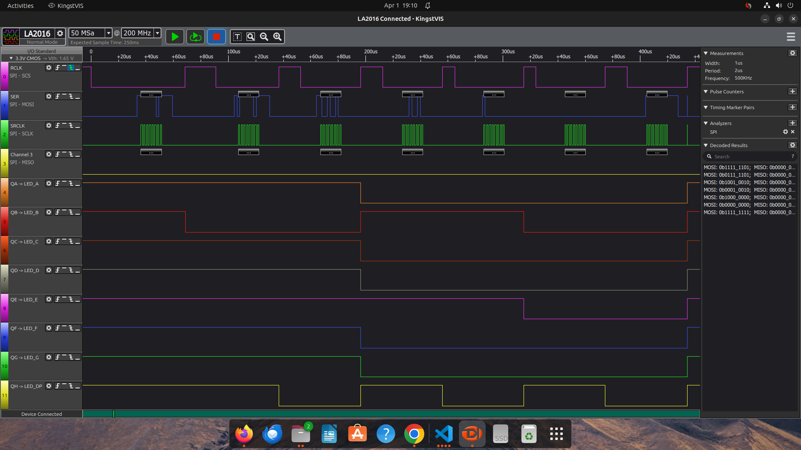
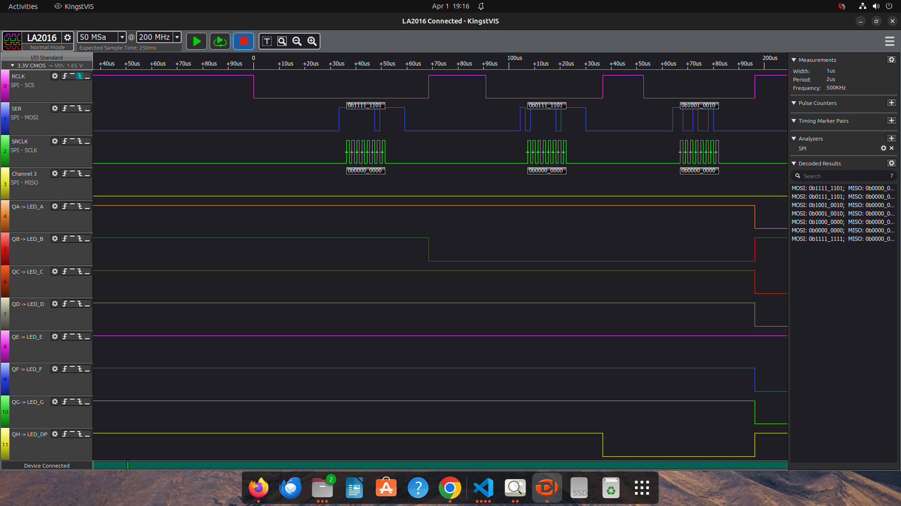
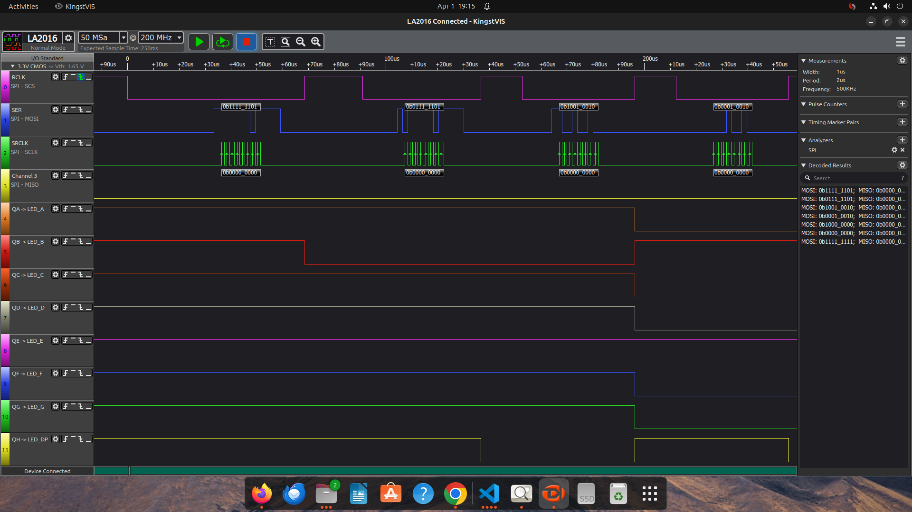
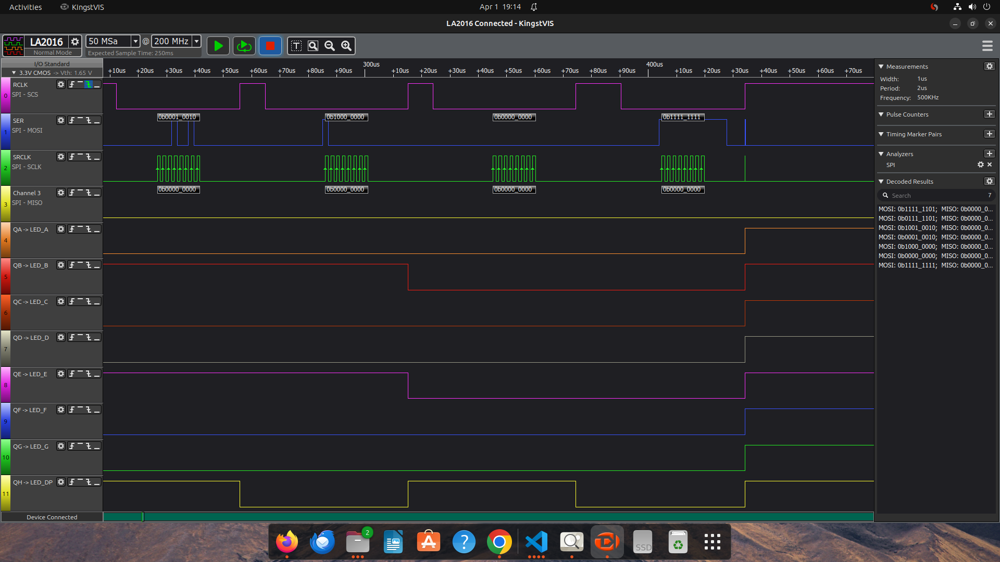
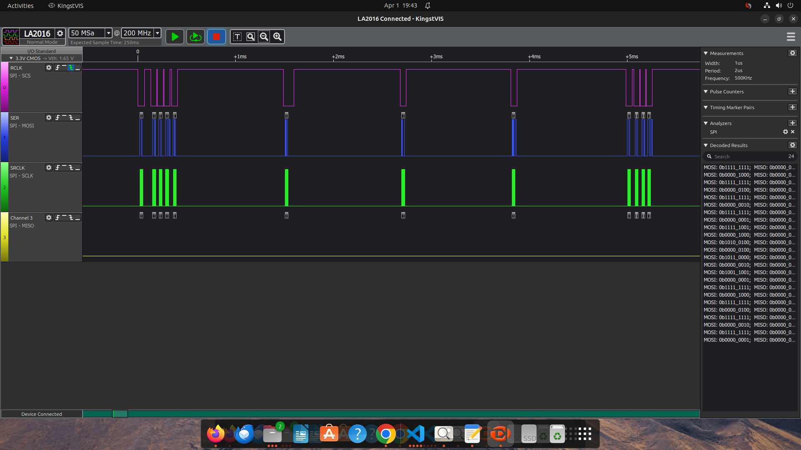
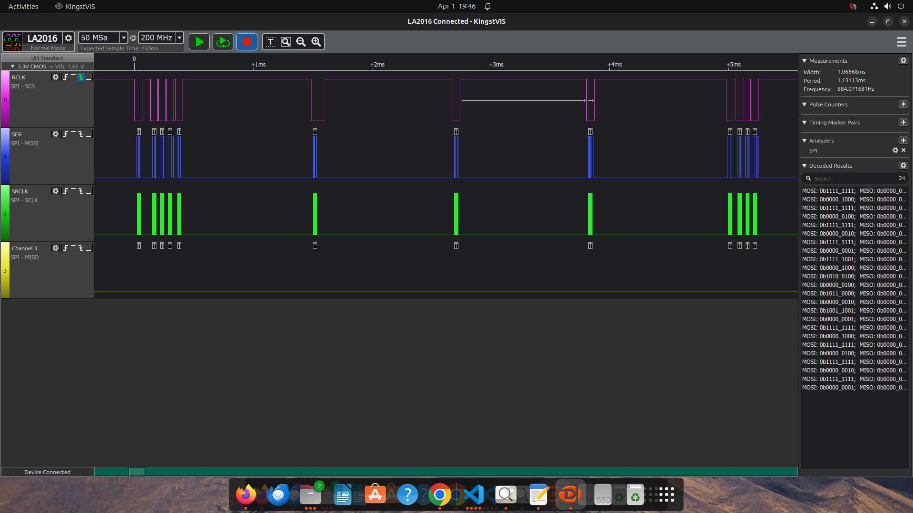
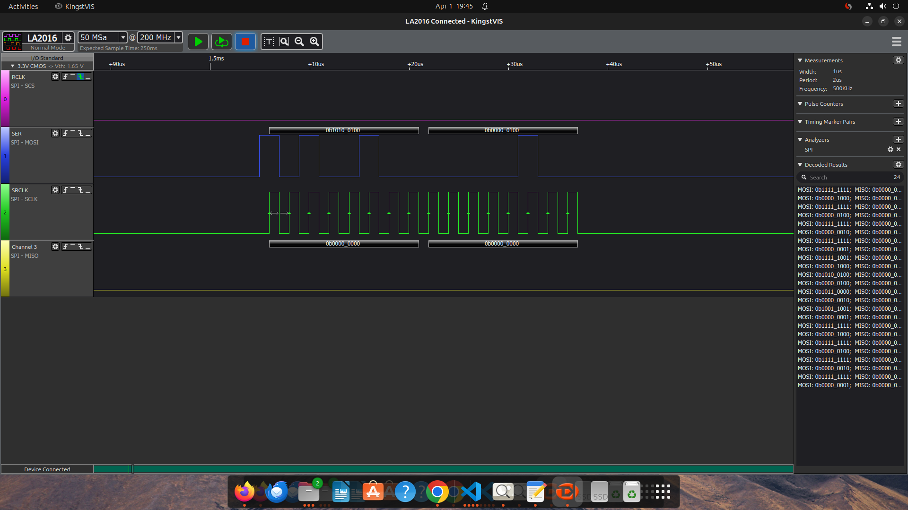
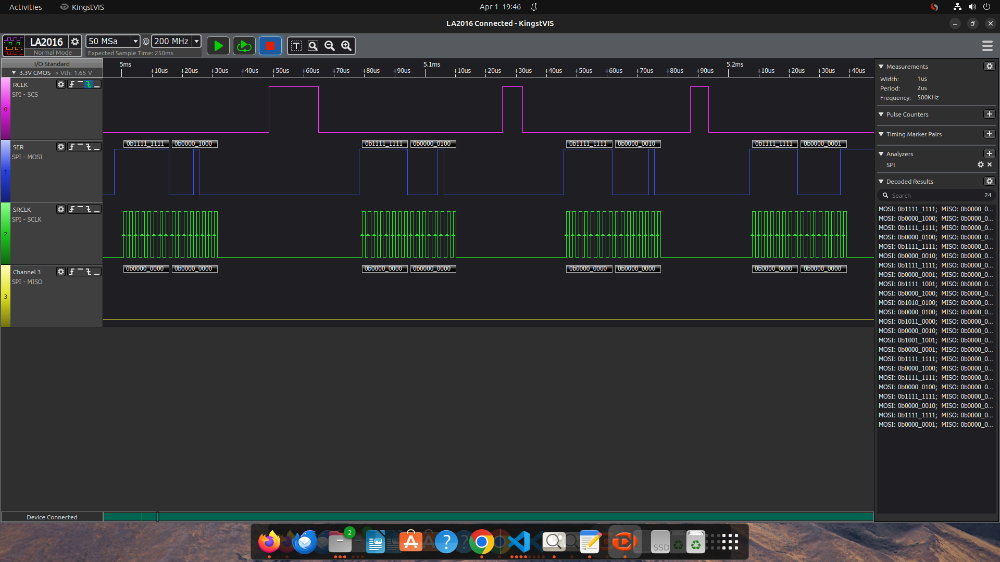

# lib-displays
Library for displays utilization
  
**Example of the output (w/o and w/ debug logs):** 
pi@raspberrypi:\~/git/lib-displays/build $ ./examples/sevseg/m74hc595/single/bicolor/sbiprog 0 test 
[INFO] Created bicolor single 7segm display [dev/typ/col/size/speedhz]: /dev/spidev0.0/1/0/1/500000 
[INFO] Released bicolor single 7segm display 
pi@raspberrypi:\~/git/lib-displays/build $ ./examples/sevseg/m74hc595/single/bicolor/sbiprog 1 test 
[INFO] Created bicolor single 7segm display [dev/typ/col/size/speedhz]: /dev/spidev0.0/1/0/1/500000 
[DBG ] Requested text to display(col:0): 'b'/1 
[DBG ] Code sent to display(ok): 00000010 -> 11111101 
[DBG ] Requested text to display(col:1): 'b'/1 
[DBG ] Code sent to display(ok): 10000010 -> 01111101 
[DBG ] Requested text to display(col:0): '5'/1 
[DBG ] Code sent to display(ok): 01101101 -> 10010010 
[DBG ] Requested text to display(col:1): '5'/1 
[DBG ] Code sent to display(ok): 11101101 -> 00010010 
[DBG ] Requested text to display(col:0): '8'/1 
[DBG ] Code sent to display(ok): 01111111 -> 10000000 
[DBG ] Requested text to display(col:1): '8'/1 
[DBG ] Code sent to display(ok): 11111111 -> 00000000 
[DBG ] Requested text to display(col:0): ' '/1 
[DBG ] Code sent to display(ok): 00000000 -> 11111111 
[INFO] Released bicolor single 7segm display 
 
  
  
  
  
  
pi@raspberrypi:\~/git/lib-displays/build $ ./examples/sevseg/m74hc595/multi/onecolor/moneprog 0 "1234" 
[INFO] Created onecolor multi 7segm display w/ shifting [dev/typ/mxtimeus/shtimems/speedhz]: /dev/spidev0.0/1/1000/500/4/500000 
[INFO] Display multiplexing started 
[INFO] Display multiplexing stopped 
[INFO] Released onecolor multi 7segm display 
pi@raspberrypi:\~/git/lib-displays/build $ ./examples/sevseg/m74hc595/multi/onecolor/moneprog 1 "1234" 
[INFO] Created onecolor multi 7segm display w/ shifting [dev/typ/mxtimeus/shtimems/speedhz]: /dev/spidev0.0/1/1000/500/4/500000 
[DBG ] Requested text to display: '1234'/4 
[DBG ] Code sent to display(ok): 00000000 -> 11111111 
[DBG ] Code sent to display(ok): 00000000 -> 11111111 
[DBG ] Code sent to display(ok): 00000000 -> 11111111 
[DBG ] Code sent to display(ok): 00000000 -> 11111111 
[INFO] Display multiplexing started 
[DBG ] Code sent to display(ok): 00000110 -> 11111001 
[DBG ] Code sent to display(ok): 01011011 -> 10100100 
[DBG ] Code sent to display(ok): 01001111 -> 10110000 
[DBG ] Code sent to display(ok): 01100110 -> 10011001 
[DBG ] Code sent to display(ok): 00000000 -> 11111111 
[DBG ] Code sent to display(ok): 00000000 -> 11111111 
[DBG ] Code sent to display(ok): 00000000 -> 11111111 
[DBG ] Code sent to display(ok): 00000000 -> 11111111 
[INFO] Display multiplexing stopped 
[INFO] Released onecolor multi 7segm display 
 
  
  
  
 
